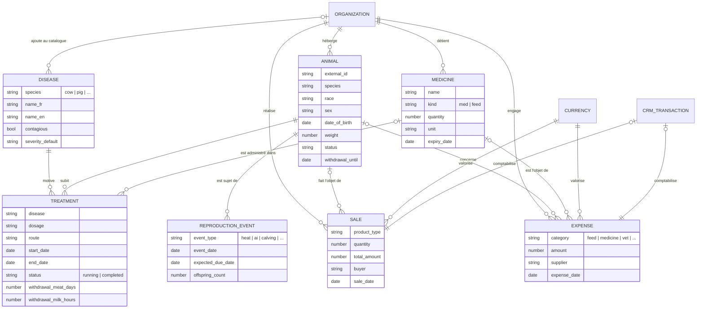

# FarmOS — Schéma de base de données

**SCRUM-193** · Schéma MySQL/Drizzle pour la gestion d'élevage (FarmOS).

- Moteur : MySQL 8 / InnoDB / utf8mb4
- Migration : `backend2/drizzle/0050_create_farmos_tables.sql`
- Permissions : `backend2/drizzle/0051_grant_farmos_permissions.sql`
- Modèle Drizzle : `backend2/src/database/schema.ts` (préfixe `farmos*`)

## Convention multi-tenant

Le plan initial prévoyait `farm_id → farms`. Le projet utilise déjà le pattern **`organization_id`** (pour PropertyManagement, HR, etc.). Toutes les tables FarmOS utilisent ce pattern pour ne pas créer un système de tenant parallèle.

Soft delete via `is_active TINYINT` (cohérent avec les autres modules).

## Espèces supportées

```
cow, pig, chicken, fish, goat, sheep, rabbit, duck, turkey
```

Validé côté DTO (`FARMOS_SPECIES` enum dans `backend2/src/farmos/dto/farmos.dto.ts`).

---

## Modèle conceptuel (MCD)

Notation entité-association. Cardinalités lues à voix haute : *« un Animal peut subir 0 à N Traitements ; un Traitement concerne 1 seul Animal »*.



### Règles de gestion (issues du MCD)

- **R1** — Un animal appartient à une seule organisation pendant tout son cycle de vie.
- **R2** — Un traitement référence exactement un animal et au plus un médicament du stock ; si `medicine_id` est null, `medicine_name` doit être renseigné (snapshot pour traçabilité).
- **R3** — Une vente sans `animal_id` est valide pour les produits de masse (œufs, lait en vrac, lots) ; `species` reste obligatoire pour les rapports.
- **R4** — Toute vente ou dépense **doit** être valorisée dans une devise (`currency_id`) connue du CRM.
- **R5** — Si `withdrawal_until > now()`, l'animal ne peut pas faire l'objet d'une vente (contrainte applicative — à implémenter dans le service).
- **R6** — La création d'une `SALE` ou `EXPENSE` déclenche la création d'une `CRM_TRANSACTION` correspondante (à implémenter — SCRUM-220). Le `transaction_id` est nullable tant que la sync n'est pas faite.
- **R7** — La suppression d'une entité FarmOS est **logique** (`is_active = 0`), jamais physique : préservation pour audit vétérinaire et comptable.
- **R8** — Toute maladie utilisée dans un `TREATMENT` doit exister dans le catalogue `farmos_diseases` (FK obligatoire). Le catalogue a deux scopes : **global** (`organization_id IS NULL`, seedé par migration, lecture seule) et **organisation** (`organization_id = X`, ajouté par l'utilisateur via `POST /farmos/diseases`). Pas de texte libre — garantit la cohérence des rapports type "incidence mammite par mois".
- **R9** — L'espèce d'une maladie doit matcher l'espèce de l'animal au moment du traitement (validation applicative dans `createTreatment`).

---

## Diagramme physique (tables et FK logiques)

```
┌───────────────────────────────────────┐
│ farmos_animals                        │
│  id (PK), organization_id             │
│  external_id, name, species, race     │
│  sex, date_of_birth, weight           │
│  lot, barn, status                    │
│  withdrawal_until, withdrawal_kind    │
│  last_event, is_active                │
└──┬────────────────────┬───────────────┘
   │                    │
   │ animal_id          │ animal_id
   ▼                    ▼
┌─────────────────┐  ┌─────────────────────┐
│ farmos_         │  │ farmos_             │
│  treatments     │  │  reproduction_      │
│  - medicine_id ─┼─┐│  events             │
│  - medicine_    │ ││  event_type         │
│    name         │ ││  event_date         │
│  - dosage,route │ ││  partner_external_  │
│  - status       │ ││    id               │
│  - withdrawal_* │ ││  expected_due_date  │
└─────────────────┘ │└─────────────────────┘
                    │
                    │ medicine_id (FK logique)
                    ▼
              ┌──────────────────┐
              │ farmos_medicines │
              │  name, kind      │
              │  quantity, unit  │
              │  min_quantity    │
              │  supplier        │
              │  expiry_date     │
              └──────────────────┘

┌───────────────────────┐    ┌──────────────────────┐
│ farmos_sales          │    │ farmos_expenses      │
│  animal_id (nullable) │    │  category            │
│  product_type         │    │  description         │
│  quantity, unit       │    │  amount, currency_id │
│  unit_price, total_   │    │  supplier            │
│    amount, currency_id│    │  expense_date        │
│  buyer, sale_date     │    │  transaction_id (FK  │
│  transaction_id (FK   │    │    logique vers CRM) │
│    logique vers CRM)  │    │  related_animal_id   │
└───────────────────────┘    │  related_medicine_id │
                             └──────────────────────┘
```

**Note FK** : les relations sont stockées en `bigint` mais sans contrainte `FOREIGN KEY` au niveau SQL (cohérent avec le reste du projet — Drizzle modélise les relations applicativement, MySQL ne contraint pas). Cela permet la suppression logique sans cascade.

---

## Tables

### `farmos_animals` — Cheptel

| Colonne | Type | Notes |
|---|---|---|
| `id` | BIGINT PK | auto-increment |
| `organization_id` | BIGINT NOT NULL DEFAULT 1 | tenant |
| `external_id` | VARCHAR(100) | ex. `BQ-2024-0118` (tag boucle) |
| `name` | VARCHAR(255) | optionnel |
| `species` | VARCHAR(50) NOT NULL | enum logique |
| `race` | VARCHAR(100) | ex. Holstein |
| `sex` | VARCHAR(10) | F / M / Mixte |
| `date_of_birth` | DATE | |
| `weight` | DECIMAL(10,2) | |
| `weight_unit` | VARCHAR(10) DEFAULT 'kg' | |
| `lot` | VARCHAR(100) | |
| `barn` | VARCHAR(100) | bâtiment / enclos |
| `status` | VARCHAR(20) DEFAULT 'healthy' | healthy / treatment / alert |
| `withdrawal_until` | DATE | délai de retrait actif |
| `withdrawal_kind` | VARCHAR(20) | milk / meat / eggs |
| `last_event` | VARCHAR(255) | dernier événement (texte libre) |
| `is_active` | TINYINT DEFAULT 1 | soft delete |
| `created_at`, `updated_at` | TIMESTAMP | |

**Index :**
- `idx_farmos_animals_org_species (organization_id, species)`
- `idx_farmos_animals_status (organization_id, status)`

### `farmos_medicines` — Stock (médicaments + aliments)

| Colonne | Type | Notes |
|---|---|---|
| `id` | BIGINT PK | |
| `organization_id` | BIGINT NOT NULL DEFAULT 1 | |
| `name` | VARCHAR(255) NOT NULL | |
| `kind` | VARCHAR(20) DEFAULT 'med' | `med` ou `feed` |
| `quantity` | DECIMAL(12,2) NOT NULL DEFAULT 0 | stock courant |
| `unit` | VARCHAR(30) | tubes, fl., L, kg, doses, balles, etc. |
| `min_quantity` | DECIMAL(12,2) | seuil d'alerte |
| `supplier` | VARCHAR(255) | |
| `expiry_date` | DATE | |
| `notes` | TEXT | |
| `is_active`, `created_at`, `updated_at` | | |

**Index :**
- `idx_farmos_medicines_org_kind (organization_id, kind)`

### `farmos_diseases` — Catalogue des maladies

| Colonne | Type | Notes |
|---|---|---|
| `id` | BIGINT PK | |
| `organization_id` | BIGINT NULL | `NULL` = catalogue global (seedé, lecture seule) ; sinon = maladie ajoutée par l'organisation |
| `species` | VARCHAR(50) NOT NULL | enum logique |
| `name_fr` | VARCHAR(255) NOT NULL | |
| `name_en` | VARCHAR(255) | |
| `contagious` | TINYINT DEFAULT 0 | 0/1 |
| `severity_default` | VARCHAR(20) | low / medium / high (suggestion par défaut au traitement) |
| `common_route` | VARCHAR(50) | voie d'administration habituelle |
| `notes` | TEXT | |
| `is_active`, timestamps | | |

**Catalogue global seedé** (31 entrées, par espèce) :
- Vache : Mammite, Boiterie, Métrite, Fièvre, Parasites internes
- Porc : Diarrhée néonatale, Toux, PRRS, Morsure de queue, Boiterie
- Poulet : Maladie respiratoire, Coccidiose, Diarrhée, Picage
- Poisson : Parasites, Champignons, Maladie de peau
- Chèvre : Parasites, Diarrhée, Boiterie
- Mouton : Parasites, Boiterie, Infection peau
- Lapin : Diarrhée, Maladie respiratoire, Parasites
- Canard : Grippe aviaire, Parasites, Infections
- Dinde : Parasites, Maladie respiratoire

**Index :**
- `idx_farmos_diseases_species (species)`
- `idx_farmos_diseases_org_species (organization_id, species)`

### `farmos_treatments` — Traitements

| Colonne | Type | Notes |
|---|---|---|
| `id` | BIGINT PK | |
| `organization_id` | BIGINT NOT NULL | |
| `animal_id` | BIGINT NOT NULL | → `farmos_animals.id` |
| `disease_id` | BIGINT NOT NULL | → `farmos_diseases.id` (catalogue global ou org) |
| `medicine_id` | BIGINT | → `farmos_medicines.id` (optionnel) |
| `medicine_name` | VARCHAR(255) | snapshot si medicine_id null |
| `dosage` | VARCHAR(255) | |
| `route` | VARCHAR(50) | injection / oral / eau / IV / IM / pond / etc. |
| `start_date`, `end_date` | DATE | |
| `vet` | VARCHAR(255) | |
| `withdrawal_meat_days` | INT | jours d'attente viande |
| `withdrawal_milk_hours` | INT | heures d'attente lait |
| `withdrawal_eggs_days` | INT | jours d'attente œufs |
| `status` | VARCHAR(20) DEFAULT 'running' | running / completed |
| `notes` | TEXT | |
| `is_active`, timestamps | | |

**Index :**
- `idx_farmos_treatments_org_animal (organization_id, animal_id)`
- `idx_farmos_treatments_status (organization_id, status)`

### `farmos_sales` — Ventes

| Colonne | Type | Notes |
|---|---|---|
| `id` | BIGINT PK | |
| `organization_id` | BIGINT NOT NULL | |
| `animal_id` | BIGINT | optionnel (lots, œufs : pas d'animal unique) |
| `species` | VARCHAR(50) | redondance utile pour rapports |
| `product_type` | VARCHAR(50) | milk / meat / eggs / wool / live |
| `quantity` | DECIMAL(12,2) NOT NULL | |
| `unit` | VARCHAR(30) | L, kg, douzaine, tête, etc. |
| `unit_price` | DECIMAL(15,2) | |
| `total_amount` | DECIMAL(15,2) NOT NULL | |
| `currency_id` | BIGINT | → `currencies.id` (CRM) |
| `buyer` | VARCHAR(255) | |
| `sale_date` | DATE NOT NULL | |
| `transaction_id` | BIGINT | → `transactions.id` (auto-sync CRM — SCRUM-220) |
| `notes` | TEXT | |
| `is_active`, timestamps | | |

**Index :**
- `idx_farmos_sales_org_date (organization_id, sale_date)`

### `farmos_expenses` — Dépenses ferme

| Colonne | Type | Notes |
|---|---|---|
| `id` | BIGINT PK | |
| `organization_id` | BIGINT NOT NULL | |
| `category` | VARCHAR(50) NOT NULL | feed / medicine / vet / maintenance / wage / other |
| `description` | VARCHAR(500) | |
| `quantity` | DECIMAL(12,2) | |
| `unit` | VARCHAR(30) | |
| `amount` | DECIMAL(15,2) NOT NULL | |
| `currency_id` | BIGINT | → `currencies.id` |
| `supplier` | VARCHAR(255) | |
| `expense_date` | DATE NOT NULL | |
| `transaction_id` | BIGINT | → `transactions.id` (auto-sync CRM — SCRUM-220) |
| `related_animal_id` | BIGINT | optionnel — pour rapports par animal |
| `related_medicine_id` | BIGINT | optionnel — pour rapports par produit |
| `notes` | TEXT | |
| `is_active`, timestamps | | |

**Index :**
- `idx_farmos_expenses_org_date (organization_id, expense_date)`
- `idx_farmos_expenses_category (organization_id, category)`

### `farmos_reproduction_events` — Événements de reproduction

| Colonne | Type | Notes |
|---|---|---|
| `id` | BIGINT PK | |
| `organization_id` | BIGINT NOT NULL | |
| `animal_id` | BIGINT NOT NULL | → `farmos_animals.id` (la femelle) |
| `event_type` | VARCHAR(50) NOT NULL | heat / ai / gestation / calving / kidding / lambing / farrow / kindling |
| `event_date` | DATE NOT NULL | |
| `partner_external_id` | VARCHAR(100) | tag du mâle |
| `expected_due_date` | DATE | calculé selon l'espèce |
| `offspring_count` | INT | naissances vivantes |
| `outcome` | VARCHAR(50) | success / lost / stillborn |
| `notes` | TEXT | |
| `is_active`, timestamps | | |

**Index :**
- `idx_farmos_repro_org_animal (organization_id, animal_id)`
- `idx_farmos_repro_type (organization_id, event_type)`

---

## Permissions

Migration `0051_grant_farmos_permissions.sql` ajoute 5 permissions standard et les accorde aux rôles `super-admin`, `admin`, `manager` :

- `create-farmos`
- `readAll-farmos`
- `readSingle-farmos`
- `update-farmos`
- `delete-farmos`

Une seule permission par scope (pas une par entité) — cohérent avec `propertyManagement`. À étendre si besoin d'un scope plus fin (ex. lecture seule sur les ventes pour un comptable).

---

## Intégration CRM

Les colonnes `transaction_id` sur `farmos_sales` et `farmos_expenses` sont les points d'accroche pour la **synchronisation automatique vers la comptabilité CRM** (SCRUM-220) :

- À la création d'une vente → créer une `transaction` (crédit) avec `relatedType='farmos-sale'`, `relatedId=sale.id`.
- À la création d'une dépense → créer une `transaction` (débit) avec `relatedType='farmos-expense'`, `relatedId=expense.id`.

La transaction du CRM existante (`transactions`) reste la source de vérité comptable ; la table FarmOS conserve uniquement le pointeur.

---

## État de livraison

| Item | État |
|---|---|
| Migration 0050 (6 tables) | ✅ Appliquée dev |
| Migration 0051 (permissions) | ✅ Appliquée dev |
| Drizzle schema (`schema.ts`) | ✅ |
| DTOs | ✅ animals + medicines + treatments (sales/expenses/reproduction à venir) |
| Service CRUD | ✅ animals + medicines + treatments |
| Controller | ✅ 18 endpoints (animals, medicines, treatments) |
| Tests unitaires | ⏳ à venir |
| Endpoints sales / expenses / reproduction | ⏳ à venir |
| Pagination + filtres | ⏳ à venir |
